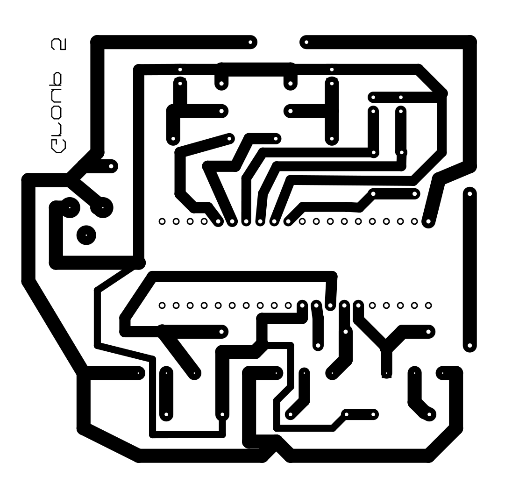
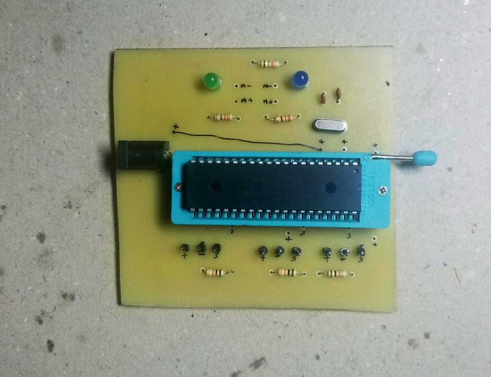
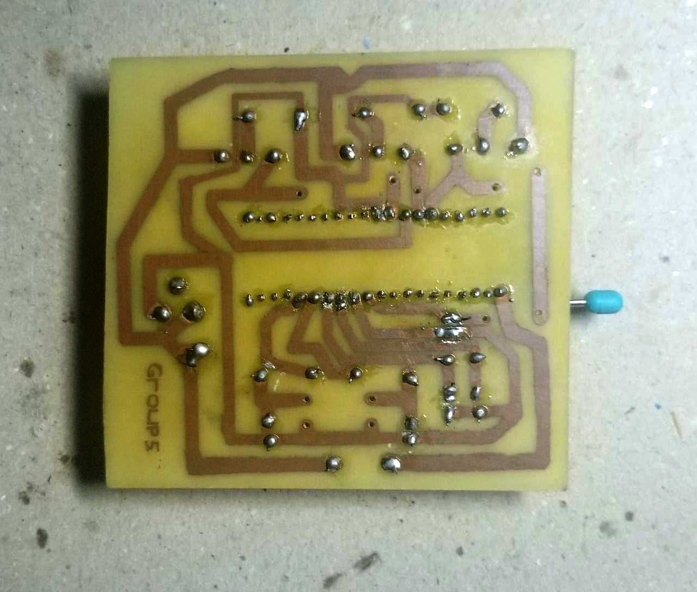

<a href="https://github.com/Brownbear2222/Microcomputers_lab5/blob/main/Continuous%20Assessment%20Cover%20Sheet.png">Cover sheet
</a>

# Microcomputers_lab4
## Objectives

The main objective of this lab is to develop a small water level controlling system of a water tank using the knowledge of interrupts and other programming techniques of PIC16F877A

## Introduction 

The primary purpose of this lab is to construct a modest water level regulating system for a water tank using the knowledge of interrupts and other programming techniques of PIC16f877A. PIC16F877A is a pic microcontroller that is utilized in a variety of tasks. This microcontroller also has a significant amount of use in the circuits of digital electronics. 

The PIC16F877A features 256 bytes of EEPROM data memory, an ICD, 2 Comparators, 8 channels of 10-bit Analog-to-Digital converter, 2 capture/compare/PWM functions, and the synchronous serial port can be configured as either 3-wire Serial Peripheral Interface (SPI) or the 2-wire Inter-Integrated Circuit (I²C) bus and a Universal Asynchronous Receiver Transmitter (USART). PIC16f877A is utilized in an extremely extensive variety of different kinds of electronics in the industry. It finds use in things like home automation, remote sensors, safety and security equipment, and a wide variety of industrial instruments.

Knowledge of making PCB is also applied to this project for a better output. A printed circuit board, or PCB, is used to hold electronic components mechanically and link them electrically via conductive channels carved from copper bonded over an insulative substrate. PCBs may have one side, two sides, or more layers, depending on their design.

The designed electronic circuit is able to control the water level of a tank with the help of two water pumps. One water pump is to control the water inlet of the tank and the other one is for the water outlet. To detect the water level of the tank, three digital water detecting sensors were utilized. The microcontroller has programmed to read the sensor signals and operate the water pumps according to a given operation table.

## The PCB design





## Procedure


The lab activity was done in two steps.
The first one was software simulation. This was done in proteus. For the simulation first we built the code in MP lab x ide. After that, the circuit was built in proteus. Then the code was uploaded to the proteus as hex file. Next, we checked the outputs and verified the code.
As the second step the hardware imputation, this was done in a printed circuit board. This step had to be done in two steps.
First, the circuit was built on a bread board and it was checked on to see whether the components were working properly, and if the circuit was working under practical scenarios. After these, the PCB was made. 

PCB making process-

There were three basic methods to make a PCB,
1.  Iron on Glossy paper method.
2.  Circuit by hand on PCB.
3.  Laser cutting edge etching.

Since laser method was the industrial method to make PCBs,  we used the first- iron on glossy paper method,

To start with this, we made the circuit design using proteus PCB design tool. Then took a printout of the circuit design using a laser printer on a glossy paper. Then cut the copper board according to the size of the layout using a hacksaw or a cutter. Next- steel wool, soft sandpaper, or abrasive sponge washes were used to scrub the copper side of the PCB to remove both the top copper oxide layer and the photoresist layer. Sanded surfaces also made it easier for the image from the paper to stick. Then cleaned the Copper clad board using alcohol. Then to transfer the printed design from the photo paper to the board (using a laser printer), it was made sure that the top layer was horizontally flipped. Next we placed the board's copper surface on the printed plan. It was ensured that the board was perfectly oriented along the printed layout's boundaries, then tape was used to keep the board and printed paper in place. After heating the electric iron to the highest temperature, we arranged the board and picture paper on a clean hardwood table with the back of the photo paper facing top. Then ironed the photo paper all the way along with the tip with a little pressure for 10 to 20 minutes. Then the iron's heat transferred the ink from the glossy paper to the copper plate. Next, the printed plate was kept in room temperature in some water for around 10 minutes after ironing. The paper was dissolved, and then it was carefully removed. Then we checked if there were any disconnections and corrected them using a permanent marker. After that, the printed board was etched in ferric chloride to remove any unwanted copper. Then, the ink was cleaned using thinner and the holes were drilled.
Finally, after the making of PCB, the components were soldered into the board.

## An image of the real implementation 




## Results

We made the PCB design and able to get the output of the two DC motors according to the switch state diagram below.

<table>
   <thead>
      <tr>
         <th>Switch 1</th>
         <th>Switch 2</th>
         <th>Switch 3</th>
         <th>Motor 1</th>
         <th>Motor 2</th>
      </tr>
   </thead>
   <tbody>
      <tr>
         <td>ON</td>
         <td>OFF</td>
         <td>OFF</td>
         <td>OFF</td>
         <td>OFF</td>
      </tr>
      <tr>
         <td>ON</td>
         <td>ON</td>
         <td>OFF</td>
         <td>ON</td>
         <td>OFF</td>
      </tr>
      <tr>
         <td>ON</td>
         <td>ON</td>
         <td>ON</td>
         <td>OFF</td>
         <td>ON for 500ms then OFF</td>
      </tr>
   </tbody>
</table>


## Discussion & Conclusion

In this experiment, mainly we were able to know how to use the knowledge of interrupts and other programming techniques of PIC16F877A to develop a small water leveling controlling system of a water tank. Before manufacturing the PCB we check the circuit by simulating on proteus. As there are no sensors in proteus we used active latched switches instead. As future engineers, the knowledge of making PCB’s is important .So our group members were able to do the PCB design from ourselves. However, the task made easy with lecture notes and did well with the help of group members. 


## The code

``` 

// PIC16F877A Configuration Bit Settings

// 'C' source line config statements

// CONFIG
#pragma config FOSC = HS        // Oscillator Selection bits (RC oscillator)
#pragma config WDTE = OFF       // Watchdog Timer Enable bit (WDT disabled)
#pragma config PWRTE = OFF      // Power-up Timer Enable bit (PWRT disabled)
#pragma config BOREN = OFF      // Brown-out Reset Enable bit (BOR disabled)
#pragma config LVP = OFF        // Low-Voltage (Single-Supply) In-Circuit Serial Programming Enable bit (RB3 is digital I/O, HV on MCLR must be used for programming)
#pragma config CPD = OFF        // Data EEPROM Memory Code Protection bit (Data EEPROM code protection off)
#pragma config WRT = OFF        // Flash Program Memory Write Enable bits (Write protection off; all program memory may be written to by EECON control)
#pragma config CP = OFF         // Flash Program Memory Code Protection bit (Code protection off)

// #pragma config statements should precede project file includes.
// Use project enums instead of #define for ON and OFF.

#define _XTAL_FREQ 20000000

#include<xc.h>
#include<htc.h>


void main(void){
    INTCONbits.GIE = 1;       // Global Interrupt Enable bit
    INTCONbits.PEIE = 1;      // Peripheral Interrupt Enable bit
    INTCONbits.INTE = 1;      // RB0/INT External Interrupt Enable bit
    
    OPTION_REGbits.INTEDG = 1;        //Interrupt Edge Select bit
   
    TRISC0 = 0;                       // PORTC pin 0 AS OUTPUT - Green LED
    TRISC1 = 0;                       // PORTC pin 1 AS OUTPUT - Red LED
    TRISB0 = 1;                       // PORTB pin 0 AS INPUT  - Push Button 1 
    TRISB1 = 1;
    TRISB2 = 1;
    
    while(1){
        
        if (INTCONbits.INTF == 0){  // Checking RB0/INT External Interrupt Flag bit
            if(!PORTBbits.RB2){
                if(PORTBbits.RB1){
                   PORTCbits.RC1 = 0;              // RED LED OFF
                   PORTCbits.RC0 = 1;             // GREEN LED ON
                }else{
                   PORTCbits.RC1 = 0;              // RED LED OFF
                   PORTCbits.RC0 = 0;
                }
            }else{
              if(PORTBbits.RB1){
                   PORTCbits.RC1 = 0;              // RED LED OFF
                   PORTCbits.RC0 = 1;             // GREEN LED ON
                }else{
                   PORTCbits.RC1 = 0;              // RED LED OFF
                   PORTCbits.RC0 = 0; 
                }
           }
        }
    }
    return;  
}
void __interrupt() isr(void) //ISR
{
    if (INTCONbits.INTF == 1){ // Checking RB0/INT External Interrupt Flag bit          
           PORTCbits.RC1 = 1;     //Turn ON the RED LED
            PORTCbits.RC0 = 0;     //Turn off the Green LED
            __delay_ms(500);
            PORTCbits.RC1 = 0;
       while(PORTBbits.RB0){
            INTCONbits.INTF = 0;  // Setting  External Interrupt Flag bit to a logic low after 10 seconds
       }
    }  
} 
```
<a href="https://github.com/Brownbear2222/Microcomputers_lab5/blob/main/lab4_1.c"> Code
</a>
